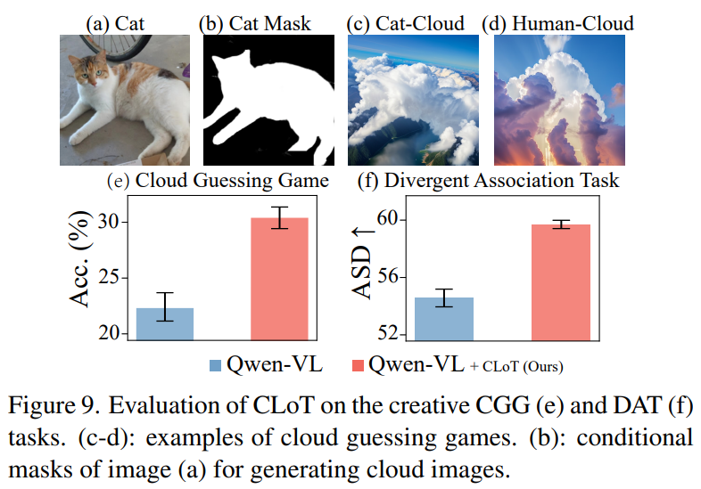

# **Awesome iKUN**

### **Previously, I had no choice, but now I aspire to be an *iKun*.**

### 🔥 Contents

- **Let's Think Outside the Box: Exploring Leap-of-Thought in Large Language Models with Creative Humor Generation.**
  [CVPR2024] [[Paper](https://openaccess.thecvf.com/content/CVPR2024/html/Zhong_Lets_Think_Outside_the_Box_Exploring_Leap-of-Thought_in_Large_Language_CVPR_2024_paper.html)] [[Code](https://github.com/sail-sg/CLoT)] 

 

- **Tune-A-Video: One-Shot Tuning of Image Diffusion Models for Text-to-Video Generation**

  [ICCV2023] [[Paper](https://openaccess.thecvf.com/content/ICCV2023/html/Wu_Tune-A-Video_One-Shot_Tuning_of_Image_Diffusion_Models_for_Text-to-Video_Generation_ICCV_2023_paper.html)] [[Code](https://github.com/showlab/Tune-A-Video)]

 

- **iKUN: Speak to Trackers without Retraining**

  [CVPR2024] [[Paper](https://openaccess.thecvf.com/content/CVPR2024/html/Du_iKUN_Speak_to_Trackers_without_Retraining_CVPR_2024_paper.html)] [[Code](https://github.com/dyhBUPT/iKUN)]

 

- **Human Evolutionary Optimization Algorithm**

  [Expert Systems 2023] [[Paper](https://www.sciencedirect.com/science/article/pii/S0957417423031408#f0010)] [[Code]()] 

 

- **Waiting for updates**

[] [[Paper]()] [[Code]()]

 